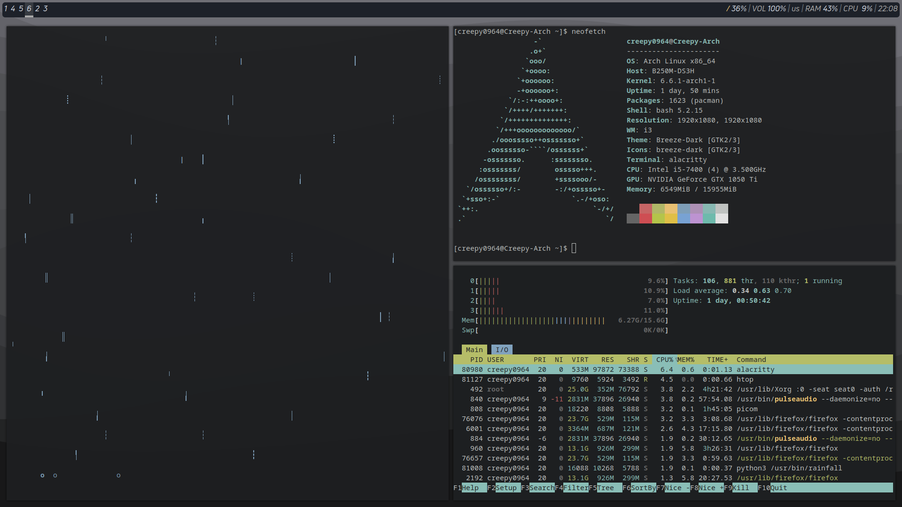

# Creepy0964's dotfiles
All my i3wm config files.

## Prerequisites
- `i3wm`
- `polybar`
- `picom`
- `alacritty`
- `feh`
- `i3lock`
- `rofi`

## Installation
For `Arch Linux` and `Arch-based` distributions, there's a script named `install_i3wm.sh`.

### Script installation
```bash
git clone https://github.com/creepy0964/dotfiles dir-name
cd dir-name
chmod +x install_i3wm.sh
./install_i3wm.sh
```
If you encountered any errors, feel free to create an issue and refer to manual installation.

### Manual installation
```bash
git clone https://github.com/creepy0964/dotfiles dir-name
cd dir-name
mkdir ~/.config/i3 && cp ./config/i3/config ~/.config/i3/config
mkdir ~/.config/polybar && cp ./config/polybar/config.ini ~/.config/polybar/config.ini
mkdir ~/.config/picom && cp ./config/picom/picom.conf ~/.config/picom/picom.conf
cp ./config/polybar/launch_polybar.sh ~/.config/polybar/launch_polybar.sh
chmod +x ~/.config/polybar/launch_polybar.sh
cp ./images/wallpaper3.png ~/Pictures/wallpaper3.png
```
If you encountered any problems, feel free to create an issue or contact me in [telegram](https://t.me/notcreepy0964).

## Preview

Note: for `polybar` in my installation I am using custom font named Uni Neue Regular. Will be added in future revisions of `dotfiles`.