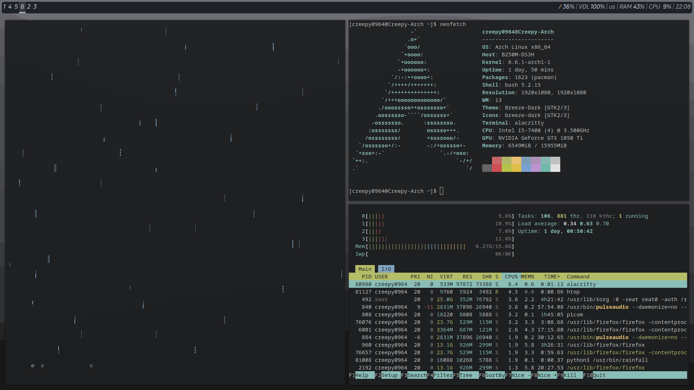

# Creepy0964's dotfiles
All my i3wm config files.

## Prerequisites
- `i3wm`
- `polybar`
- `picom`
- `alacritty`
- `feh`
- `rofi`
- Font 'Uni Neue Regular'

## Installation
There's a script named `setup.sh`. If you're too lazy, you can execute this script. Supports Arch-based and Gentoo-based distributions.

### Script installation
```bash
git clone https://github.com/creepy0964/dotfiles dir-name
cd dir-name
chmod +x setup.sh
./setup.sh
```
If you encountered any errors, feel free to create an issue and refer to manual installation.

### Manual installation
Temporary unavailable.

## Preview

