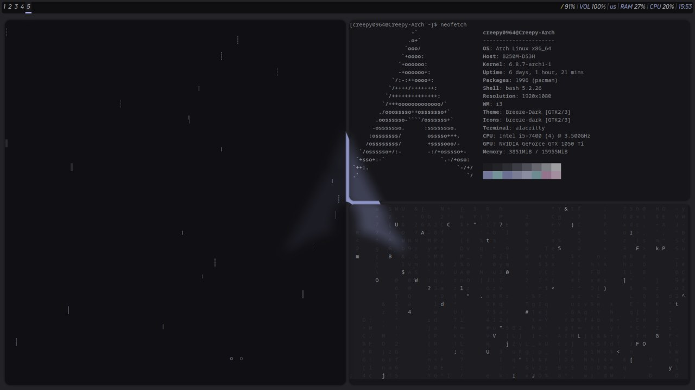
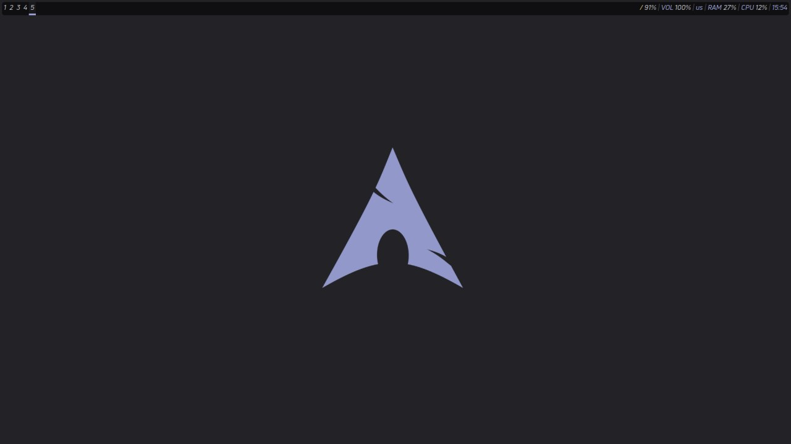
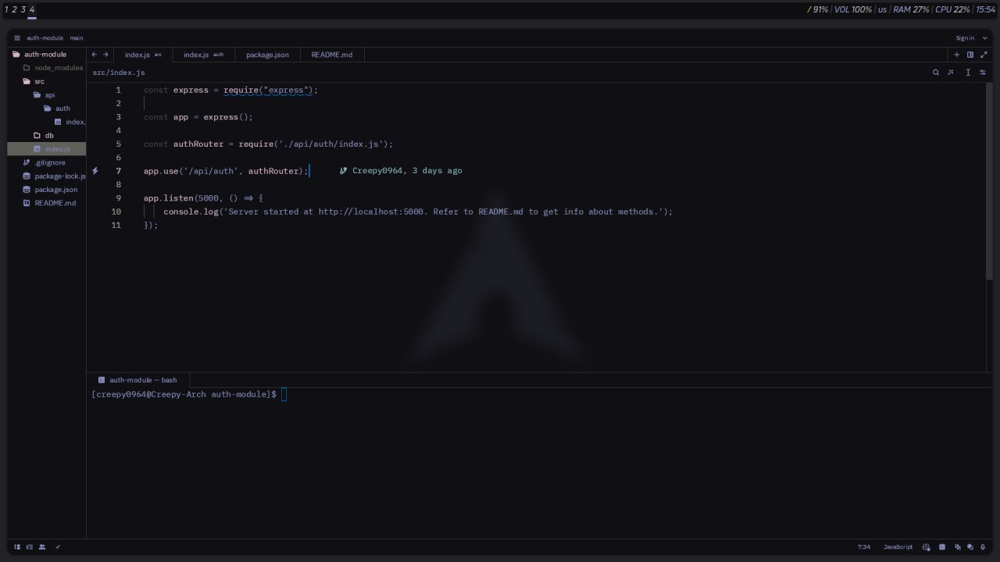

# dotfiles
just my dotfiles for i3wm

# prerequisites
- `alacritty`
- `i3wm`
- `picom`
- `polybar`
- `rofi`
- optional: `zeditor`

# installation
- copy all directories to $HOME/.config/
- copy `wallpaper_arch.png` to $HOME/Pictures/
- copy `UniNeueRegular.ttf` to /usr/local/share/fonts/
- optional: if needed, refer to NOTEBOOK.md to attach the battery module to `polybar`
- optional: if needed, copy `creepy0964.json` to $HOME/.config/zed/themes/

# example

# todo
- [ ] more fancy wallpapers (different distros, some pixel arts maybe)
- [ ] install script
- [ ] more themes to install (`telegram-desktop`, `firefox`, `code`, etc.)